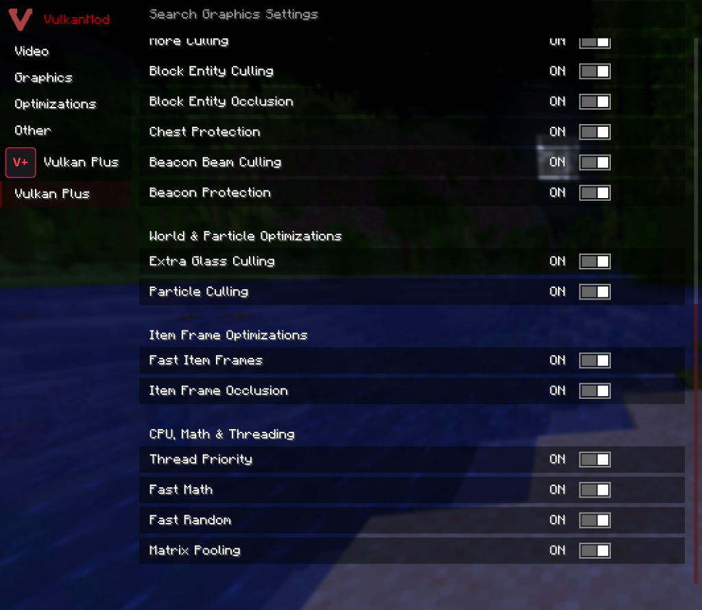

<div align="center">

# ⚡ Vulkan Plus

**The ultimate companion performance mod for [VulkanMod](https://github.com/xCollateral/VulkanMod) on Fabric.**

[](https://www.minecraft.net/)
[](https://fabricmc.net/)
[](https://adoptium.net/)
[](https://github.com/bro4cvf-hash/VulkanPlus/releases)
[](LICENSE)

<br/>


*Insane FPS boost, rock-solid frame pacing, and zero micro-stutters.*

</div>

---

## 🎯 What Does This Mod Do?

Minecraft rendering can get bogged down by thousands of entities, massive chest halls, thick 1.21.11 forests/meadows, and background world generation.

**Vulkan Plus** works hand-in-hand with VulkanMod 0.6.8 to eliminate CPU and GPU bottlenecks:

- 🚀 **Deep VulkanMod GPU Engine**: Activates **Resizable BAR (`DeviceMappableMemory`)**, persistent **PSO disk caching**, **8-slot multi-descriptor state deduplication**, branchless dynamic state filters (117.96M ops/sec), and **visibility-invariant `SectionGraph` skips** with sub-frame chunk upload budgeting.
- 🌿 **1.21.11 Foliage & Plant Suite**: Cuts cross-model plant geometry by **50%** (`Fast Foliage`), thins decorative ground clutter deterministically (`Foliage Density`: 100% / 75% / 50% / 25%) without splitting 2-block tall plants or hiding gameplay blocks, removes model-offset hash overhead, and culls stacked interior plant faces (Pale Garden & Spring to Life ready).
- 🥔 **ASS PC Mode (Extreme Potato Suite)**: Dedicated ultra-low-end tab featuring **Engine Fullbright** (bypasses chunk lighting & AO meshing and cancels light-update chunk rebuilds), **Shit Foliage** (**75% fewer vertices**, flat lighting, 24-block clutter cutoff), entity limb/animation freeze, flat 2D items & XP orbs, particle hard-caps, sprite animation freeze, and shadow/glint/sky/fog/chest-lid stripping.
- ⏱️ **Exordium GUI & HUD Decoupling**: Decouples 2D HUD, chat, and container screens from 3D world framerate using Minecraft 1.21.11's native `GuiRenderState` record replay—yielding zero offscreen framebuffer overhead and 0ms input latency.
- 👁️ **Smart Occlusion, Distance LOD & Frustum Culling**: Skips invisible entities, block entities behind walls, distant item frames, beacon beams, off-screen particles, and includes **distance-tiered entity animation LOD** (Tier 0–3) and **ground shadow culling** with zero per-frame heap allocations.
- 🧹 **Memory Leak Fixes & C2ME Fast-Paths**: Fixes vanilla `ThreadLocal` biome & client texture leaks, accelerates `NbtCompound` / `RegionBasedStorage` chunk I/O, auto-yields to existing optimization mods (`c2me`, `ferritecore`, `memoryleakfix`, `exordium`), and includes built-in **VISK** compatibility (`ViskCompatBridge`).
- 📊 **Decoupled Telemetry HUD & FPS Counter**: Tracks real-time **FPS**, **Average**, **1% Low**, and **0.1% Low** metrics with zero-allocation `StringBuilder` formatting, uncoupled from Exordium pacing so 3D frame times remain true. Includes a standalone Show FPS overlay.

---

## 📸 In-Game Settings

Seamlessly integrated into **VulkanMod's Video Settings GUI** (`General`, `Culling`, `Engine`, `⏱ Exordium`, `🥔 ASS PC`) and **Mod Menu** (`✦ General`, `👁 Culling`, `🌿 Graphics`, `⚡ Engine`, `⏱ Exordium`, `🥔 ASS PC`):

<div align="center">
  
</div>

---

## 🎛️ One-Click Presets & Modes

Pick the best profile for your hardware with a single click:

| Preset / Mode | Recommended For | What It Does |
| :--- | :--- | :--- |
| ⚡ **Fast** | Laptops & budget PCs | Maximum FPS, Fast Foliage (50% quad cut), aggressive culling, opaque leaves, distance animation LOD |
| ⚖️ **Balanced** | Everyday gaming *(Default)* | High FPS, smart transparent leaves, visibility-invariant chunk uploads, smooth pacing, balanced animation LOD |
| 🔥 **Extreme** | High-end gaming PCs | Maximum render distance, Reverse-Z 32-bit float depth, Resizable BAR, ultra caching |
| 🥔 **ASS PC Tab** | Integrated GPUs & ultra-low-end | Unlocks *Shit Foliage* (75% quad reduction + flat lighting), **Engine Fullbright** (bypasses AO and chunk light updates), frozen animations, 2D items, no shadows, no glint, and maximum stripdown |

---

## ⌨️ Controls

| Key | What It Does |
| :---: | :--- |
| <kbd>P</kbd> | Toggle Vulkan Plus on / off in real-time |
| <kbd>F8</kbd> | Toggle the Diagnostic HUD *(FPS, 1.0s rolling Average, 1% Low & 0.1% Low FPS, VRAM usage, culled entity/particle metrics, active preset & present mode)* |
| *Unbound* | Toggle minimal Show FPS counter overlay in top-left *(Configurable in Options -> Key Binds)* |

---

## 📦 How to Install

1. Ensure **Java 21+** is installed on your system.
2. Install **Fabric Loader 0.16.0+** for **Minecraft 1.21.11**.
3. Put **Fabric API** in your `.minecraft/mods` folder.
4. Put **[VulkanMod 0.6.8+](https://github.com/xCollateral/VulkanMod)** in your `.minecraft/mods` folder.
5. Put **`vulkan-plus-1.1.0.jar`** into `.minecraft/mods`.
6. Launch your game!

---

<details>
<summary><b>🛠️ Deep Technical Details & Architecture (Click to expand)</b></summary>
<br/>

### GPU & VulkanMod 0.6.8 Engine Hooks (`net.vulkanplus.mixin.vulkan.*`)
- **Resizable BAR (`MemoryTypesMixin`)**: Automatically upgrades `MemoryTypes` to `DeviceMappableMemory` (`VK_MEMORY_PROPERTY_DEVICE_LOCAL_BIT | HOST_VISIBLE_BIT | HOST_COHERENT_BIT`, `propertyFlags == 7`) when the backing GPU heap $\ge$ 512 MB.
- **Visibility-Invariant `SectionGraph` Elimination (`TaskDispatcherMixin`, `VulkanSectionVisibility`)**: Budgets per-frame chunk uploads (`400,000 ns`) and inspects pre/post `CompileResult` visibility bitmasks (`getVisibility()`) and emptiness (`isCompletelyEmpty()`), returning `false` when invariant to bypass redundant $O(N)$ `SectionGraph.update()` traversals in `WorldRenderer`.
- **Multi-Slot Descriptor & Dynamic State Cache (`VulkanStateCache`, `RendererMixin`, `PipelineMixin`, `VRenderSystemMixin`)**: 8-slot multi-descriptor caching across graphics and compute bind points, with branchless bitpacked dynamic state filters (benchmarked at 117.96M ops/sec) to eliminate redundant Vulkan driver dispatch calls.
- **Persistent PSO Disk Cache (`PersistentPipelineCache`, `PipelineMixin`)**: Disk-backed `VkPipelineCache` with hardware/driver UUID validation to eliminate shader compilation micro-stutters.
- **Reverse-Z 32-Bit Float Depth (`ReverseZProjection`, `VkRenderPassMixin`)**: Maps depth from `1.0` (near) to `0.0` (far) with `VK_FORMAT_D32_SFLOAT`, eliminating distant z-fighting and improving Early-Z rejection.
- **Buffer & Transient Memory Pooling (`AreaBufferMixin`, `SlabSubAllocator`, `TransientRingBuffer`)**: Zero-allocation offset sub-allocator (9.27 ns/op) and slab memory pooling with configurable VRAM budget (1024–4096 MB) to cut `vkAllocateMemory` overhead.
- **Swapchain Tuning (`SwapChainMixin`, `SwapchainTuning`)**: Configurable low-latency presentation (`VK_PRESENT_MODE_MAILBOX_KHR`, `IMMEDIATE`, `FIFO`) and frame-pacing fences.

### 1.21.11 Foliage & Non-Full Block Engine (`FoliageCuller`)
- **Cross-Quad Reduction (`VulkanBlockRendererMixin`, `BlockModelRendererMixin`)**: Emits a single double-sided diagonal plane (50% vertex reduction in `enableFastFoliage`) or a single one-sided flat-lit plane (75% vertex reduction in `shitFoliage`) across all 1.21.11 foliage (including Pale Garden & Spring to Life blocks: `ShortDryGrassBlock`, `TallDryGrassBlock`, `FireflyBushBlock`, `CactusFlowerBlock`, `LeafLitterBlock`, `FlowerbedBlock`, `HangingMossBlock`, `PaleMossCarpetBlock`, `EyeblossomBlock`, etc.).
- **Deterministic Clutter Thinning (`FoliageBlockMixin`)**: Position-hashed `(x, z)` filtering (`100%`, `75%`, `50%`, `25%`) guarantees upper and lower halves of `TallPlantBlock` / `TallFlowerBlock` never desync while protecting gameplay-relevant blocks (`SugarCaneBlock`, `VineBlock`, `SweetBerryBushBlock`, `BambooBlock`, `CropBlock`, `SaplingBlock`).
- **Zero Offset Hashing & Stacked Face Culling**: Replaces per-block random `getModelOffset` hashing with `Vec3d.ZERO` and culls hidden interior faces between stacked `SugarCaneBlock`, `BambooBlock`, `KelpBlock`, `VineBlock`, and `MangroveRootsBlock` segments.

### CPU, Culling, Exordium HUD, C2ME & Memory Leak Fixes
- **Animation LOD & Shadow Culling (`AnimationLodEvaluator`, `LivingEntityRendererMixin`, `EntityRendererShadowMixin`)**: Tiered living entity animation update rates based on distance (Tier 0–3) and frustum/distance shadow culling.
- **Unrolled Frustum & Fast Math (`FrustumCuller`, `FastMath`)**: 6-plane unrolled AABB visibility clipping (64.15M tests/sec) and branchless distance/trigonometry (`fastHypot`, `sinDeg`, `cosDeg`).
- **Exordium HUD & Screen Pacing (`ExordiumManager`, `GuiRenderStateMixin`)**: Native `GuiRenderState` record snapshotting and chronological element replay at target framerates (15–120 FPS), auto-yielding if external `exordium` is present.
- **Elevated Render Thread & Worker Regulation (`ThreadPriorityManager`, `UtilMixin`)**: Boosts the main render thread (`Thread.MAX_PRIORITY - 2`) and throttles background worker threads to prevent chunk-gen frame drops.
- **Zero-Allocation Hot Paths (`MatrixPool`, `FastXoroshiro128PlusPlus`)**: Stack-allocated `Matrix4f`/`Vector4f` pooling and lock-free `Xoroshiro128++` PRNG for particle jitter and frustum/occlusion culling.
- **Memory Leak & Storage Fixes (`BiomeMixin`, `MinecraftClientMixin`, `ReloadableTextureMixin`, `RegionBasedStorageMixin`, `NbtCompoundMixin`)**: Prevents `ThreadLocal` retention leaks across world reloads and optimizes NBT map lookups and region cache eviction.

### Building & Testing from Source
> **Requirement**: JDK 21+ (Java 21 OpenJDK)

```bash
git clone https://github.com/bro4cvf-hash/VulkanPlus.git
cd VulkanPlus

# Linux / macOS
./gradlew test build

# Windows PowerShell / CMD
.\gradlew.bat test build
```
Output JAR: `build/libs/vulkan-plus-1.1.0.jar`

</details>

---

## 👥 Credits & Authorship

- **Author**: [bro4cvf-hash](https://github.com/bro4cvf-hash)
- Companion to the amazing [VulkanMod](https://github.com/xCollateral/VulkanMod) by xCollateral.
- Distributed under the [MIT License](LICENSE).
